# Redacted Context MCP

Give coding agents useful local project context without exposing raw client
names, people, email addresses, URLs, phone numbers, secrets, or meaningful
filenames.

`redacted-context-mcp` is a read-only-by-default MCP server and CLI. It lets an
agent search, navigate, and read useful content from a private local folder
while replacing sensitive text and returning opaque file references.

Before redaction:

```text
Client Example Lantern Labs uses production-db.internal.example
Contact avery@example.com about PROJECT-LANTERN-042.
```

Agent-visible result:

```text
Client [ORG_a81f29d4a9c1e672540f68afc10d22c7] uses [DOMAIN_d12c88e1f730065c97d3f82f06d1188c].
Contact [EMAIL_711ae704108cd6e952dcb27f0d6e999a] about [SENSITIVE_45f80ab22bc94e105a93aa830c7d3b9c].
```

The placeholder values above are illustrative. Real values are deterministic
for one local vault salt and will differ.

## How It Works

The agent never opens the private folder itself. It calls `redctx_*` tools,
the server reads the raw files or configured GitHub issues, redacts every
content field at one boundary, and returns only redacted text with opaque
references such as `@p_1a2b3c4d5e6f`.

In the diagrams, blue is the agent side, purple is processing inside redctx,
amber is a check, green is redacted output or success, red is raw private data
or a refusal, orange is a human step, explicit opt-in, or softer guardrail, and
grey is a non-sensitive store.

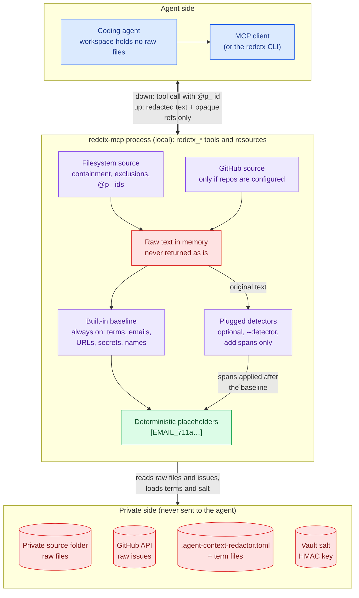

Placeholders and path ids are deterministic for one vault salt, so the agent
can follow the same name or file across calls. Only the local operator can
turn them back into raw text:

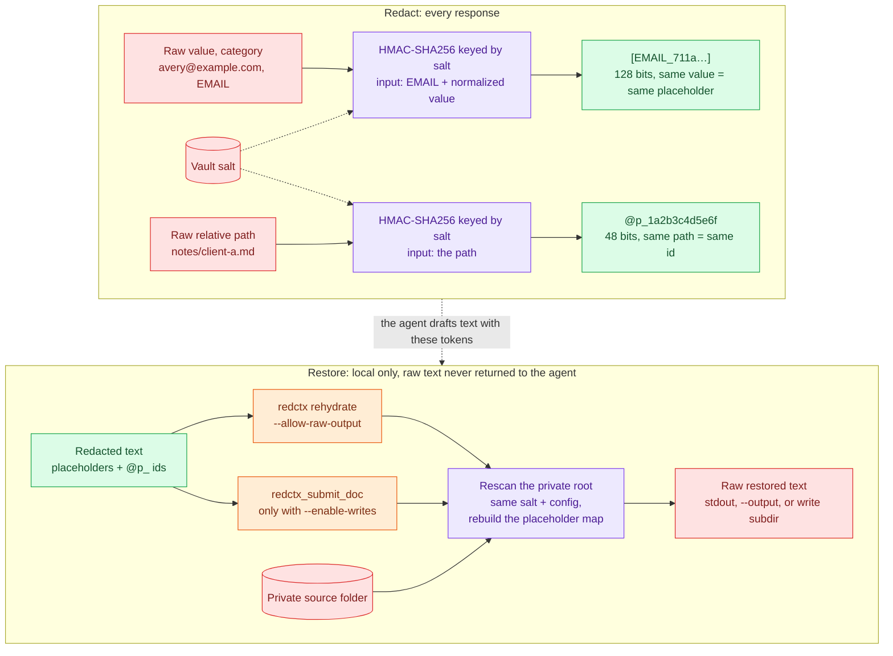

Restoring needs the private folder and the same salt and config; a redacted
file alone is not enough. See [Local Rehydration](#local-rehydration) and
[Controlled MCP Writes](#controlled-mcp-writes).

## Quick Start

The whole setup, from install to the first tool call:

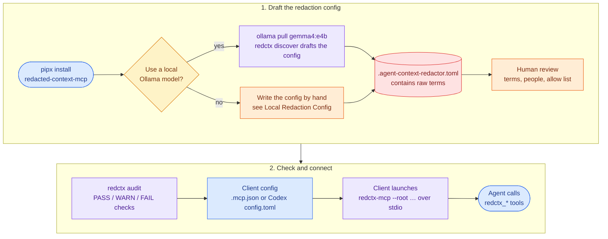

Python 3.11 or newer is required. Install the commands with `pipx`, then use a
local Ollama model to draft the project-specific redaction terms:

```sh
pipx install redacted-context-mcp
ollama pull gemma4:e4b
redctx --root ~/private-context discover \
  --model gemma4:e4b \
  --output .agent-context-redactor.toml
```

Review the generated `.agent-context-redactor.toml` because it intentionally
contains the raw names and terms that should be hidden. Then audit the setup
and start the stdio MCP server:

```sh
redctx --root ~/private-context audit
redctx-mcp --root ~/private-context
```

Discovery is explicit: `audit` does not call a model or generate this config.
Without an explicit config, the built-in detectors still cover common emails,
URLs, phone numbers, domains, secrets, and some names, but project-specific
client names and codenames may be missed. To avoid Ollama, create the config
manually using the [Local Redaction Config](#local-redaction-config) example.

The server waits for an MCP client on standard input; press Ctrl-C if you start
it directly in a terminal. For a no-credentials walkthrough using fictional
data, see the [self-contained quick-start demo](examples/quickstart/README.md).

### Claude Code MCP Configuration

Claude Code is one of the clients already supported by this repository. Put
the following in the agent workspace's `.mcp.json`, replacing the root with an
absolute path to the private context folder:

```json
{
  "mcpServers": {
    "redacted_context": {
      "type": "stdio",
      "command": "redctx-mcp",
      "args": [
        "--root",
        "/absolute/path/to/private-context"
      ]
    }
  }
}
```

The same installed `redctx-mcp` command can be used with the Codex and generic
stdio configurations documented below.

## Security Boundary

This project provides practical privacy guardrails, not guaranteed
anonymization, sandboxing, cryptographic isolation, complete DLP, or perfect
prevention of metadata leakage. File sizes, line counts, and timing remain
possible metadata side channels.

The protection can be bypassed if the coding agent can also read the
unredacted source directory through shell commands or other filesystem tools.
For hard enforcement, run the agent as a separate OS user or in a container
that cannot access that directory directly, and expose only the MCP server or a
separate redaction service.

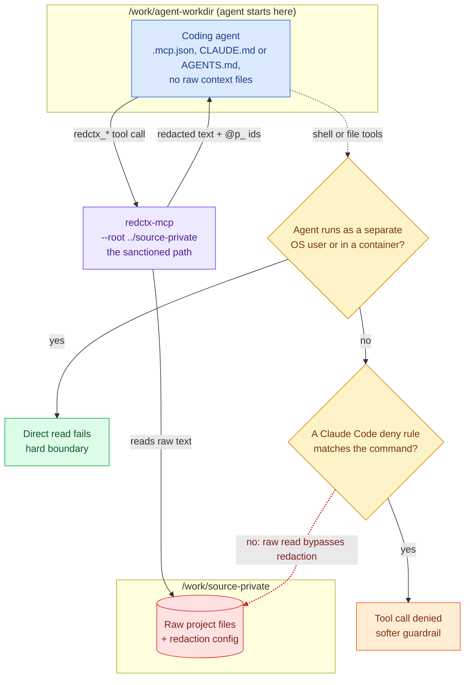

Claude Code deny rules (see
[examples/claude-settings.example.json](examples/claude-settings.example.json))
only block the commands they list, so they are a softer guardrail than OS-level
isolation.

Read [SECURITY.md](SECURITY.md) for the threat model and
[SECURITY_INVARIANTS.md](SECURITY_INVARIANTS.md) for the behavior the test suite
is intended to preserve.

## Features

- Dual-era MCP stdio server supporting stateless `2026-07-28` clients and
  legacy initialization-based clients through `2025-11-25`.
- Redacted MCP resources using `redctx://p_<id>` URIs.
- Optional MCP `redctx_submit_doc` tool for controlled writes of generated
  redacted documents back into a configured private-root subdirectory.
- CLI fallback with the same redaction behavior.
- Local-salted opaque stable path ids such as `@p_1a2b3c4d5e6f`.
- Deterministic 128-bit HMAC placeholders such as
  `[PERSON_1a2b3c4d5e6f7890a1b2c3d4e5f60718]`.
- Bounded operation budgets for traversals, reads, bundles, searches, audits,
  benchmarks, discovery samples, MCP resource listing/reads, and controlled
  write rehydration scans.
- Redacted `tree`, `list`, `read`, `search`, `stat`, `bundle`, `audit`, and
  `benchmark` operations.
- CLI-only `rehydrate` command for restoring redacted exports locally from the
  private source root.
- Local ignored redaction config for exact client, person, organization, and
  project terms.
- Optional local-LLM discovery command to draft that config from private files
  without sending content to Claude or a hosted model.
- No runtime Python dependencies.
- Optional local DOCX, PPTX, PDF, XLSX, and XLS extraction using Microsoft MarkItDown.
- Ranked multi-word passage retrieval with opaque references and line citations.
- Works well with a neutral agent workspace that does not contain raw context
  files.

## Who This Is For

Use this when you want an agent to reason over a private local folder without
handing the model the raw names and identifiers in that folder.

Good fits:

- consulting or client delivery knowledgebases;
- internal project notes, stakeholder notes, and transcripts;
- architecture or governance documentation with private names mixed in;
- private GitHub issues that should be summarized through neutral aliases.

Do not treat this as a formal anonymization or data-loss-prevention system.

## Installation Options

The recommended installation method is `pipx`:

```sh
pipx install redacted-context-mcp
```

Regular `pip` installation is also supported:

```sh
python -m pip install redacted-context-mcp
```

Install from a source checkout only for development or to test an unreleased
version:

```sh
python -m pip install -e .
```

This installs two console commands:

```sh
redctx      # CLI
redctx-mcp  # MCP stdio server
```

For `redctx discover`, install [Ollama](https://ollama.com/) separately and
pull a local model such as `gemma4:e4b`. The core redacted CLI and MCP server do
not require Ollama.

Model tags must match Ollama exactly. Check installed tags with `ollama list`
and pass the full value shown in the `NAME` column to `--model`.

## Recommended Layout

Use two sibling folders under a neutral parent:

```text
/work/
  agent-workdir/    # Claude Code starts here; no raw context files
  source-private/   # private project/context repository
```

The agent starts in `agent-workdir/`. The MCP server reads
`source-private/`, redacts output, and returns only redacted text.

Keep the private folder outside the active agent workspace when possible. If
the agent can still run shell commands against the raw private folder, the MCP
redaction layer is only an instruction-level guardrail, not a hard boundary.

## Claude Code MCP Config

If `redctx-mcp` is installed, put this in `agent-workdir/.mcp.json`:

```json
{
  "mcpServers": {
    "redacted_context": {
      "type": "stdio",
      "command": "redctx-mcp",
      "args": [
        "--root",
        "../source-private"
      ]
    }
  }
}
```

If running directly from a source checkout without installing:

```json
{
  "mcpServers": {
    "redacted_context": {
      "type": "stdio",
      "command": "python3",
      "args": [
        "../redacted-context-mcp/src/redacted_context_mcp/server.py",
        "--root",
        "../source-private"
      ]
    }
  }
}
```

Then start Claude Code from the agent workspace:

```sh
cd /work/agent-workdir
claude
```

If Claude Code was already running, restart it or reconnect MCP servers with
`/mcp`.

For persistent Claude Code guidance, copy `examples/agent-CLAUDE.md` into
`agent-workdir/CLAUDE.md`.

## Codex MCP Config

Codex supports local stdio MCP servers through `config.toml`. Put this in
`~/.codex/config.toml`, or in `agent-workdir/.codex/config.toml` for a trusted
project-scoped setup:

```toml
[mcp_servers.redacted_context]
command = "redctx-mcp"
args = ["--root", "../source-private"]
enabled = true
required = true
```

If running directly from a source checkout without installing:

```toml
[mcp_servers.redacted_context]
command = "python3"
args = [
  "../redacted-context-mcp/src/redacted_context_mcp/server.py",
  "--root",
  "../source-private",
]
enabled = true
required = true
```

For persistent Codex guidance, copy `examples/agent-AGENTS.md` into
`agent-workdir/AGENTS.md`. Codex reads `AGENTS.md` when a session starts, so
restart Codex after adding or changing it.

## Generic MCP Clients

Any MCP client that can launch a stdio server can run:

```sh
redctx-mcp --root /absolute/path/to/source-private
```

Use the client-specific configuration format to pass that command and args.
The server advertises instructions and exposes only redacted `redctx_*` tools.
Modern clients can use the stateless MCP `2026-07-28` flow with per-request
metadata and `server/discover`; legacy clients continue to negotiate through
`initialize`.

## MCP Tools

The server exposes the tools below. Most work starts by finding an opaque
`@p_` id and then reading that file or line range. After files are created or
renamed, `redctx_refresh_index` rebuilds the id index:

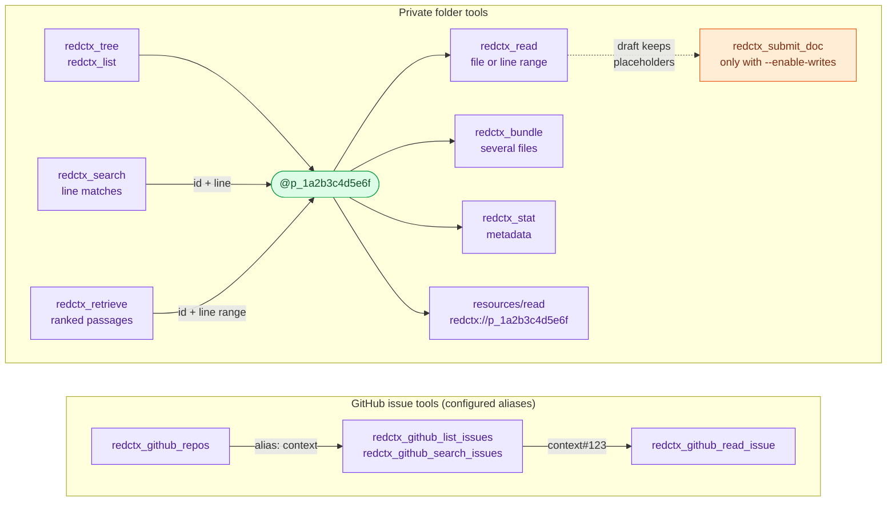

| Purpose | Tool | What it returns |
|---|---|---|
| Navigate | `redctx_tree` | Indented directory overview, one `@p_<id> <redacted name>` line per entry |
| Navigate | `redctx_list` | Directory entries with opaque ids, entry types, sizes, and redacted paths (optionally recursive) |
| Find | `redctx_search` | Exact substring or regex line matches over redacted text, with context lines |
| Find | `redctx_retrieve` | Passages ranked by query-word coverage and BM25 relevance, with line citations |
| Read | `redctx_read` | One redacted file or an inclusive line range of it, with source line numbering preserved |
| Read | `redctx_bundle` | Several redacted files concatenated in one response, with per-file and total limits |
| Read | `redctx_stat` | Metadata for one path: opaque id, redacted path, type, size, and line count |
| Check | `redctx_doctor` | Counts of the active redaction setup, without printing terms or scanning files |
| Check | `redctx_audit` | Containment, configuration, and synthetic-leak checks with PASS/WARN/FAIL/NOT_TESTED results |
| Check | `redctx_refresh_index` | Rebuilds the opaque path index after files are created or renamed |
| GitHub | `redctx_github_repos` | Configured GitHub repo aliases (local config only, no GitHub request) |
| GitHub | `redctx_github_list_issues` | Issues from a repo alias filtered by state and labels, one line each |
| GitHub | `redctx_github_search_issues` | Issues matching a GitHub issue-search query, one line each; the query leaves the machine unredacted |
| GitHub | `redctx_github_read_issue` | One issue's redacted body and, optionally, comments |
| Write | `redctx_submit_doc` | Rehydrates and writes a drafted document; listed only with `--enable-writes` |

Each tool's MCP description says when to use it instead of its siblings, what
its output looks like, and which limits apply; every parameter is documented in
the input schema. Agents should carry `@p_<id>` references and placeholders
between calls rather than using raw filenames. GitHub issue text is untrusted
external content.

Every file tool call goes through the same steps. Here is one `redctx_read`
call on an opaque id:

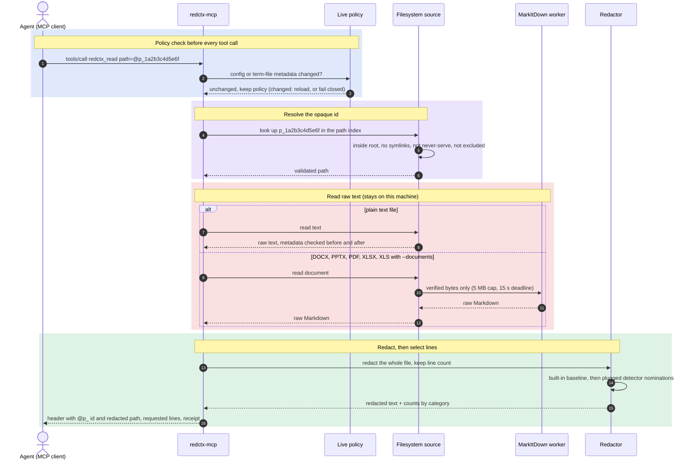

The MCP server also exposes redacted text files as resources:

- `resources/list` returns `redctx://p_<id>` resource URIs with redacted titles.
- `resources/read` returns redacted file text for those opaque resource URIs.

### Controlled MCP Writes

By default, the MCP server exposes only read-only tools. To let an agent submit
new redacted documents back into the private source root, start the server with
an explicit write subdirectory:

```sh
redctx-mcp --root ../source-private --enable-writes --write-subdir incoming
```

This adds `redctx_submit_doc`. The tool accepts a relative `target_path`,
redacted `text`, and optional `overwrite`. The server rehydrates known
placeholders locally, rejects unresolved redaction tokens, and writes only under
the configured write subdirectory. It refuses with `Write target is protected.`
to write the config file, configured term files, detector rule files (or
anything under a protected detector directory), and files named like `.env*`,
`*.key`, `*.pem`, or `*.crt`, even with `overwrite`, and it refuses any
`target_path` containing `:` (drive letters and NTFS alternate data streams).
Tool responses use redacted paths and opaque ids; they do not return the raw
restored path.

The checks run in this order, and the first failure refuses the write:

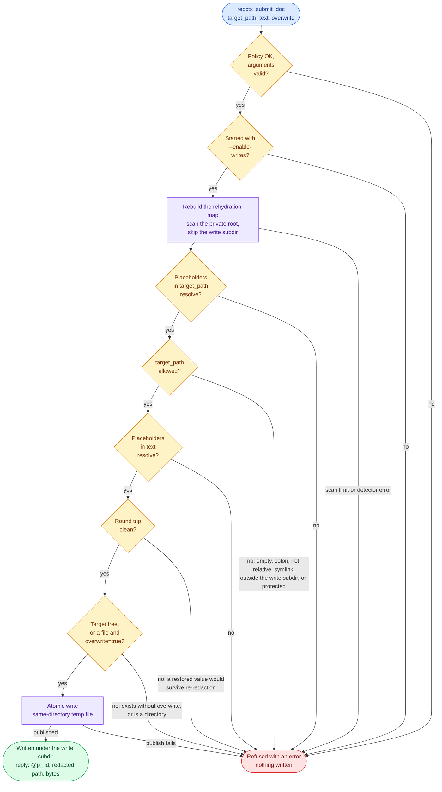

"Policy OK" is the live policy check that every tool call runs. The
`target_path` checks run in this order: not empty, no `:`, relative without
`..`, no symlink, inside the write subdirectory, and not a protected file
listed above. The round trip re-redacts the restored text and the restored
`target_path` in the server's mode and in balanced mode, and every restored
value must disappear. An existing directory is refused even with `overwrite`.

## CLI Fallback

The CLI is useful for smoke tests or clients without MCP:

```sh
redctx --root ../source-private doctor
redctx --root ../source-private tree context --max-depth 2
redctx --root ../source-private search "governance" context --ignore-case --context 2
redctx --root ../source-private read @p_1a2b3c4d5e6f --start-line 1 --end-line 80
redctx --root ../source-private bundle context --glob "*.md" --max-files 10
redctx --root ../source-private audit --format json
redctx --root ../source-private benchmark --format json
```

### Ranked Retrieval

Use `retrieve` when you want relevant passages for several keywords, even when
the words appear in a different order or on different lines:

```sh
redctx --root ../source-private retrieve "database backup recovery" \
  --max-results 8 --max-chars 12000
```

The MCP equivalent is `redctx_retrieve` with `query`, optional `paths` and
`glob`, `max_results`, and `max_chars`. Each result includes an opaque file
reference and a line range that can be passed to `redctx_read` for more context.
Passages covering more query terms rank first, then BM25 keyword relevance;
matching is case-insensitive and ignores a small set of common English words.
Existing literal and regex `search` behavior is unchanged.

Only redacted text is tokenized and scored. Complete placeholders can be used
as search terms. Retrieval keeps no persistent index, makes no model calls,
and has no additional dependencies. Results contain complete passages within
the character budget; if none fits, increase `max_chars`. A limit notice marks
omitted matches. Scan limits fail the request instead of presenting a partial
scan as a complete ranking. Narrow `paths` or `glob` for large knowledgebases.

### Optional Document Extraction

Install the optional [Microsoft MarkItDown](https://github.com/microsoft/markitdown)
integration and enable it explicitly for the CLI or MCP server:

```sh
python -m pip install 'redacted-context-mcp[documents]'
redctx --root ../source-private --documents retrieve "database backup recovery"
redctx --root ../source-private --documents read @p_1a2b3c4d5e6f
redctx-mcp --root ../source-private --documents
```

For pipx, install with `pipx install 'redacted-context-mcp[documents]'`, or add
the dependencies to an existing installation with
`pipx inject redacted-context-mcp 'markitdown[docx,pptx,pdf,xlsx,xls]>=0.1.7,<0.2'`.
For an MCP client configuration, add `--documents` to the server's `args`.

Supported formats are **DOCX, PPTX, PDF, XLSX, and XLS**. They become available
through read/head/tail, search, retrieve, bundle, local discovery, rehydration
source scans, and MCP resources. Conversion produces local Markdown, then the
same redactor processes it. Line citations refer to extracted Markdown lines,
not PDF pages or slide numbers. The extractor does not reproduce document
layout or evaluate spreadsheet formulas.

The plain installation stays dependency-free. Installing the extra alone does
not change which files are exposed; `--documents` removes only the built-in
exclusions for supported formats. Configured exclusions and never-serve paths
still apply. Each document is read through the existing containment checks and
converted in a short-lived local worker with a 15-second deadline, 5 MB input
cap, 1 million extracted-character cap, and OOXML expansion limits (50 MB and
2,000 ZIP members). Existing operation budgets also apply. No raw converted
Markdown is persisted; the MCP resource cache holds redacted text only.

Only the selected format converter is invoked on local bytes. URL fetching,
plugins, cloud conversion, audio transcription, and LLM/OCR clients are not
enabled. Legacy `.doc` and `.ppt` files must be exported to a supported format.
Scanned PDFs need OCR outside this MCP; an empty extraction produces a clear
error. Encrypted, malformed, or oversized documents fail with non-sensitive
errors. Conversion is an additional parser surface, not a hard sandbox; use
the isolation described in [Security Boundary](#security-boundary) for untrusted
source files.

### Local Rehydration

The `rehydrate` command restores redacted text by scanning the private source
root with the same salt and config, rebuilding the placeholder map, and applying
it to a redacted file or folder. This emits raw private text, so it is CLI-only
and requires an explicit acknowledgement flag.

```sh
redctx --root ../source-private rehydrate ./redacted-output.md --allow-raw-output > raw-output.md
redctx --root ../source-private rehydrate ./redacted-folder \
  --output ./raw-folder \
  --allow-raw-output
```

Rehydration is not cryptographic reversal. A redacted file alone is not enough;
the command needs access to the original private root or equivalent local
source material to rebuild the mapping.

## Local Redaction Config

Create `.agent-context-redactor.toml` in the private source root. This file is
ignored by the example `.gitignore` because it may contain exact sensitive
terms.

```toml
[redaction]
salt = "local-random-string-kept-private"
clients = ["Client Legal Name", "Client Acronym"]
organizations = ["Supplier Name", "Partner Company"]
people = ["Person One", "Person Two"]
terms = ["project codename", "internal programme name"]
allow = ["Azure", "PostgreSQL", "Kubernetes"]
term_files = ["private-redaction-terms.txt"]

[github.repos.context]
owner = "private-org-or-user"
repo = "private-context-repo"
token_env = "GITHUB_TOKEN"
```

The tool also derives likely aliases from the private source folder name and
accepts additional comma- or newline-separated terms through
`REDACTED_CONTEXT_TERMS`.

The optional `salt` controls opaque path ids and deterministic placeholders.
If omitted, `redctx` creates or reuses a random 256-bit vault salt in user-local
state. Empty, malformed, or root-contained salt state fails closed instead of
silently rotating aliases. You can also set `REDACTED_CONTEXT_SALT` in the
environment that starts `redctx` or `redctx-mcp`. `redctx doctor` reports
whether the active salt came from local state, config, or environment.

GitHub repo entries are optional. Use neutral aliases such as `context`; agents
use the alias, while the real `owner/repo` stays in this local config. Private
repos require the named token environment variable in the shell that starts
`redctx` or `redctx-mcp`.

### Updating Rules During an MCP Session

The MCP server automatically checks the local config and its referenced
`term_files` before each tool call or resource list/read. Save your reviewed
rules and retry the request: new terms, exclusions, allow-list changes, and
detector profiles take effect without reconnecting. This also picks up config
updates written by `discover-update`.

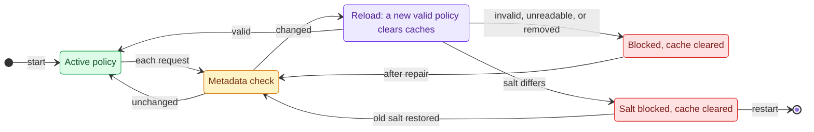

For example, adding a project codename to `terms` causes the next read of an
already cached document to redact that codename. Successful policy changes
clear the redacted resource cache, path index, and old rehydration mappings.
Opaque path references and placeholders for unchanged terms remain stable as
long as the salt and applicable redaction category stay the same.

If the config is invalid or unreadable, or a previously loaded config or
still-referenced term file disappears, context requests fail closed with a
non-sensitive error. Repair the file and retry; the server recovers without a
restart. Referenced term files remain optional until first loaded and are
watched for creation.
To deliberately stop using a term file, remove its `term_files` entry.

Salt changes require a server restart and fresh opaque references; requests
are blocked until restart or restoration of the original salt. Changes to the
launch environment, server flags, or external vault-salt state also require a
restart. Reload checks use file metadata at request boundaries; they do not
retract previously returned content or provide protection against adversarial
concurrent filesystem changes.

## Pluggable Detectors

The built-in detectors (configured terms, emails, URLs, phone numbers,
secrets, IP addresses, and the name heuristics) always run and need no extra
dependencies. You can add local detectors on top of that baseline with the
repeatable `--detector SPEC` option on both `redctx` and `redctx-mcp`, where
`SPEC` is `NAME` or `NAME=ARGUMENT`:

```sh
redctx-mcp --root ../source-private --detector patterns=~/redctx/patterns.toml
redctx --root ../source-private --detector patterns=~/redctx/patterns.toml read @p_1a2b3c4d5e6f
```

On every request, the baseline and the plugged detectors work together like
this:

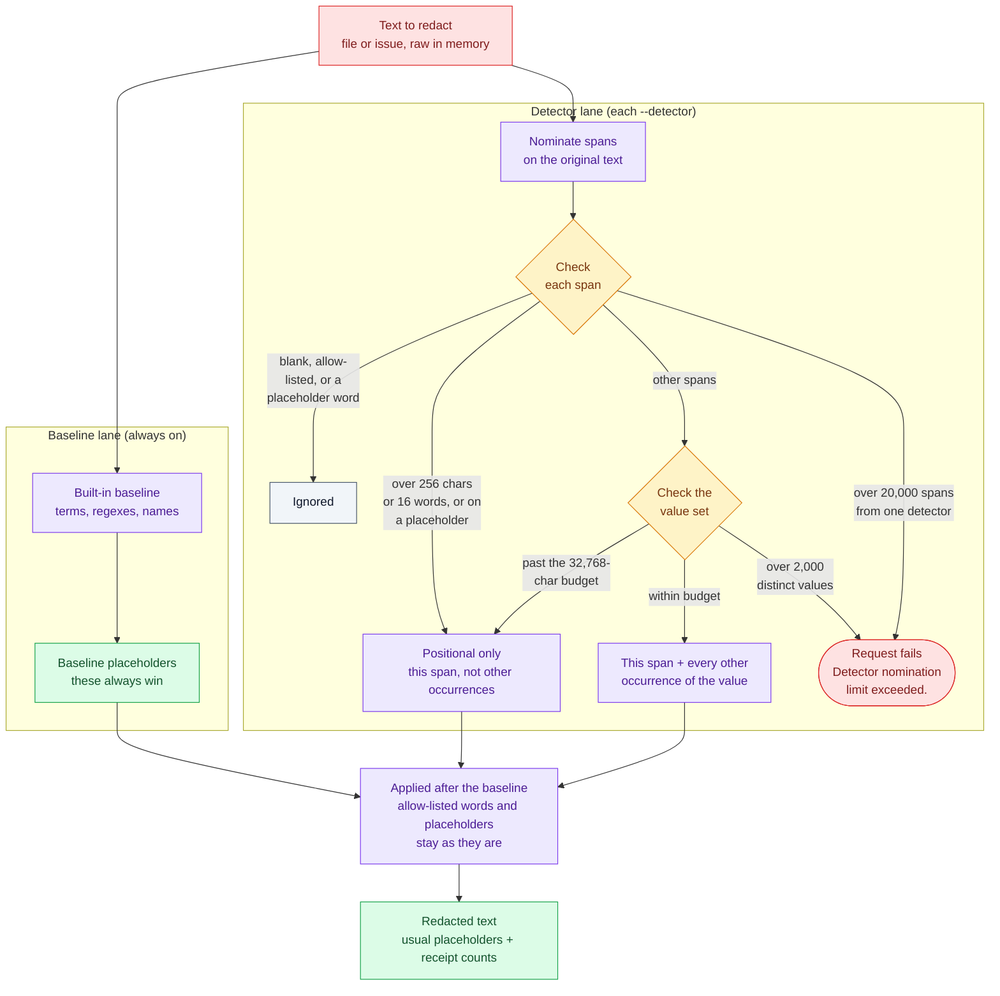

The built-in `patterns` detector reads a TOML file of regex rules. Each rule
names a placeholder category (`PERSON`, `ORG`, `CLIENT`, `SENSITIVE`, `ID`,
`EMAIL`, `SECRET`, and the other built-in categories) and a regex:

```toml
[[patterns]]
category = "ID"
regex = 'TICKET-\d{4,}'

[[patterns]]
category = "SENSITIVE"
regex = 'project\s+lantern'
ignore_case = true
```

Rules are operator-trusted configuration, like the term list, and they run
in-process on every request. At startup each regex is screened statically for
catastrophic backtracking and then stress-tested in a separate process: every
rule is timed over synthetic inputs built from its own character classes and
literal prefix (for example a long run of capital letters for `[A-Z]+\d`), at
10,000 and 40,000 characters. A rule is rejected with its rule number (never
its text) as too slow when one run takes more than 2 seconds, or as superlinear
when the larger input takes more than eight times as much CPU time as the
smaller one (linear growth is four times, quadratic sixteen). Growth is
measured in CPU time and a suspicious rule is re-timed, with at most five timed
runs per input size, so a busy machine does not reject a linear rule. This adds about 2.5 seconds to
startup for 256 simple anchored rules (0.2 seconds for one rule, most of it
starting the process). The checks catch common mistakes, not every slow
pattern: a pathological rule can still stall your own server, so anchor rules
with literal text (`TICKET-\d{4,}` rather than `\w+-\d+`) and keep them simple.
Rules that are unanchored or anchored only with `\b`, and whose unbounded
classes mix `.` or `-` with word characters, are quadratic on text such as
`a.a.a.…` (every position is a word boundary and starts a new attempt) and are
rejected. The common email rule
`\b[A-Za-z0-9._%+-]+@[A-Za-z0-9.-]+\.[A-Za-z]{2,}\b` is one of them; bound the
repeated part instead, for example
`\b[A-Za-z0-9._%+-]{1,64}@[A-Za-z0-9.-]+\.[A-Za-z]{2,}\b`.

The startup checks for `patterns` rules, in order:

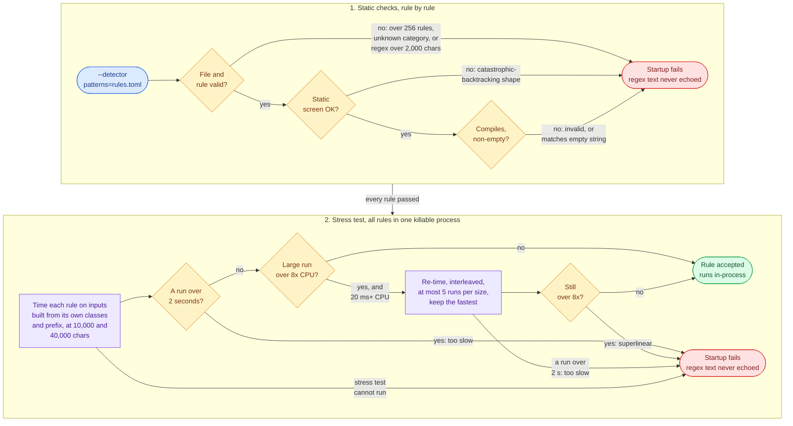

If the rules file lies under the served root it is treated like a term file:
it is never listed, read, served, or overwritten by controlled writes, even
with `--include-private`. A third-party detector that declares a directory as
protected protects everything below it.

Detectors can only add redaction. A detector nominates text spans; the server
always redacts each nominated span itself and also every other occurrence of
the nominated value, with the usual deterministic placeholders, so read-back,
rehydration, and controlled writes behave exactly as they do for configured
terms. Nominations are applied after the built-in baseline: anything the
baseline redacts keeps the baseline's placeholder, and when the baseline has
already redacted part of a nominated value (for example strict mode redacting
`TICKET` in `TICKET-12345`), the remaining raw part is redacted separately.
Only ASCII whitespace and ASCII punctuation at the edge of such a remainder
(the `-` here) stay visible. Allow-listed words are never redacted by plugged
detectors, but the rest of a nomination around them is: with `Data` allowed,
a nominated `Contoso Data Services` becomes `[ORG_…] Data [ORG_…]`. Values
that are themselves allow-listed are ignored. Detectors never run on file
paths: an identifier that `patterns` finds in file content can still appear in
a file name, where only the built-in path redaction applies.

Each detector may return at most 20,000 spans per text, and all detectors
together at most 2,000 distinct values per text; beyond that the request fails
with `Detector nomination limit exceeded.`. A nominated span longer than 256
characters or 16 words (a long token, say) is still redacted where it was
nominated, but its other occurrences are not searched for; such spans are
counted as `positional` in the receipt. The same happens to the longest values
once the nominated values of one text add up to more than 32,768 characters:
beyond that budget only the nominated spans themselves are redacted.
A nominated span is redacted even inside a longer word (`123456` in
`ID123456`). Other occurrences match only where the neighbouring characters
are not ASCII letters or digits, so a value is also redacted inside a longer
word that continues with accented or non-Latin letters (`Ádám` inside
`éÁdám`, or `李明` inside `李明华`), and next to `İ`, `ı`, `ſ`, or the Kelvin
sign. Configured terms use the same boundaries, except that their check is
case-insensitive and so treats those four letters as ASCII letters: a
configured `Ali` is not redacted in `Aliİ`. Like configured terms,
placeholders treat values that differ only in ASCII whitespace or case as one
value; the same name written with a non-breaking space, or with case variants
that fold differently (`İstanbul` and `ISTANBUL`), gets a separate
placeholder. A nominated value matches other occurrences only through the
regex engine's simple case folding, so variants such as `Weiß` and `WEISS`,
or `finn` and `finn`, are redacted only when each is nominated or when a
detector returns them.

Detectors must run locally and be deterministic for identical input. Treat a
detector like any code that sees your raw private text. Detectors load once at
startup; policy reloads keep the same detector instances. A detector error
fails the request with `Detector failed.` and never relays library output. If a
controlled write fails because a detector no longer finds a restored value, add
that value to the configured terms. `redctx doctor` and tool receipts list the
active detectors by name and version.

`redctx discover --detector SPEC` and `redctx discover-update --detector SPEC`
draft redaction terms with a local detector instead of an Ollama model; no
model call is made. Only the `--detector` given after the subcommand does
this: a global `--detector` before `discover` configures redaction and leaves
discovery on Ollama. `--model` and `--endpoint` apply only to Ollama and are
rejected together with the subcommand's `--detector`.

Third-party packages can register detector factories under the
`redacted_context_mcp.detectors` entry-point group, and can check their
detector against the engine's contract by mixing
`redacted_context_mcp.testing.DetectorConformance` into a
`unittest.TestCase`. The built-in names (`patterns`, `presidio`, `gliner`) are
resolved first and cannot be taken over by an entry point.

Two optional NER adapters ship with the package. Their libraries are optional
extras, imported only when the detector is enabled; without them the package
stays dependency-free. Options are a comma-separated `key=value` list after the
detector name. Each adapter only adds redaction: the built-in baseline always
runs alongside it.

When an adapter reports one value inside another, a nested value of the same
category collapses into the containing one, but a nested value of a different
category is kept: a person named inside an organization span, or the domain
inside an email address, is nominated on its own so its other occurrences are
redacted too.

Detectors run on every file a request redacts. `redctx_search`,
`redctx_retrieve`, and `redctx_bundle` over the whole root therefore run them
on every file they scan, so the cost of a slow detector multiplies with the
size of the root; narrow those calls with `paths` or `glob`.

### Presidio Detector

[Microsoft Presidio](https://microsoft.github.io/presidio/) combines spaCy NER
with pattern recognizers for structured identifiers.

```sh
pip install "redacted-context-mcp[presidio]"
python -m spacy download en_core_web_lg

redctx-mcp --root ../source-private --detector presidio
redctx-mcp --root ../source-private --detector "presidio=model=en_core_web_sm,threshold=0.6"
redctx --root ../source-private --detector "presidio=entities=PERSON|ORGANIZATION|US_SSN,map=ORGANIZATION:CLIENT" read @p_1a2b3c4d5e6f
```

Install the spaCy model into the same environment as `redacted-context-mcp`
(with pipx, use that environment's Python). Missing models are never
downloaded automatically; startup fails with the `python -m spacy download`
command to run. Presidio makes no network calls and writes nothing at request
time: its email recognizer normally downloads the Public Suffix List on first
use and caches it in your home directory, so the adapter switches it to the
copy bundled with `tldextract`. spaCy runs on the CPU (`PRESIDIO_DEVICE=cpu`
unless you set that variable yourself), so results stay deterministic even
when a CUDA build of torch is installed. With `en_core_web_sm`, a typical
document takes well under a second.

| Option | Default | Meaning |
|---|---|---|
| `model` | `en_core_web_lg` | Installed spaCy model package (Presidio's default model). |
| `language` | `en` | Analysis language; the model must support it. |
| `threshold` | `0.5` | Minimum Presidio score from 0 to 1. Presidio scores phone numbers 0.4 and URLs 0.5; the baseline already covers both. |
| `entities` | all mapped types | `\|`-separated allowlist of Presidio entity types. |
| `include_dates` | `false` | Also redact `DATE_TIME` results (as `SENSITIVE` unless mapped). |
| `map` | none | `\|`-separated `ENTITY_TYPE:CATEGORY` overrides with canonical categories. Each entity type must be one Presidio reports for the language (startup fails on a typo such as `ORGANISATION`). |

| Presidio entity type | Category |
|---|---|
| `PERSON` | `PERSON` |
| `ORGANIZATION` | `ORG` |
| `EMAIL_ADDRESS` | `EMAIL` |
| `PHONE_NUMBER` | `PHONE` |
| `US_SSN` | `SSN` |
| `IP_ADDRESS` | `IP` |
| `URL` | `URL` |
| `CREDIT_CARD` | `CARD` |
| `IBAN_CODE` | `IBAN` |
| `US_DRIVER_LICENSE` | `DRIVER_ID` |
| `US_PASSPORT` | `PASSPORT` |
| `LOCATION`, `NRP` | `SENSITIVE` |
| `MEDICAL_LICENSE`, `US_BANK_NUMBER`, `US_ITIN`, `UK_NHS` | `ID` |
| `CRYPTO` | `SECRET` |
| `DATE_TIME` | skipped; `SENSITIVE` with `include_dates=true` |
| anything else | skipped unless added with `map` |

Text longer than about 100,000 characters is analyzed in overlapping chunks
cut at paragraph or line breaks, with offsets mapped back to the original
text. Presidio often reports the domain of an email address as a separate
`URL`; it is nominated as its own value, as described above. Presidio and
spaCy run locally and are deterministic for identical input. Receipts and
`redctx doctor` show the version as
`<presidio-analyzer version>/<spaCy model package>-<model version>`, for
example `2.2.364/en_core_web_sm-3.8.0`.

### GLiNER Detector

[GLiNER](https://github.com/urchade/GLiNER) is a zero-shot NER model that
finds entities for labels you name. It is better at names and organizations
than at structured identifiers, which the baseline regexes already cover.

```sh
pip install "redacted-context-mcp[gliner]"

redctx-mcp --root ../source-private --detector gliner
redctx-mcp --root ../source-private --detector "gliner=offline=true,threshold=0.6"
redctx-mcp --root ../source-private --detector "gliner=labels=person:PERSON|company:ORG|project code name:SENSITIVE"
```

On Linux, the `gliner` extra pulls the default CUDA build of torch, a
download of several gigabytes. The adapter runs on the CPU only, so install
the CPU wheel first:

```sh
pip install torch --index-url https://download.pytorch.org/whl/cpu
pip install "redacted-context-mcp[gliner]"
```

| Option | Default | Meaning |
|---|---|---|
| `model` | `urchade/gliner_small-v2.1` | Hugging Face model id (`namespace/name`) or an absolute path to a local model directory. A value that looks like a path (a backslash, a leading `.`, `~`, `/`, or drive letter, or an existing directory) must be absolute and exist; anything else must be a Hub id. Invalid values fail at startup and are never sent to the Hub. Receipts name only the default model; any other value shows as `custom`. |
| `revision` | latest | Hub branch, tag, or commit to load. Pin a commit to keep detections reproducible across restarts. |
| `threshold` | `0.5` | Minimum GLiNER score from 0 to 1. |
| `labels` | `person:PERSON\|organization:ORG` | `\|`-separated `label:CATEGORY` pairs that replace the defaults. Labels are passed to the model exactly as written. |
| `offline` | `false` | `true` loads only from the local Hugging Face cache and never touches the network. |
| `window` | `300` | Words per analysis window (at most the model's limit, 384 for the default model). |
| `overlap` | `50` | Words shared by consecutive windows; must be smaller than half of `window`. |
| `max_tokens` | `512` | Subword tokens per window, including the label prompt (at most the encoder's maximum sequence length, 512 for the default model). |

Without `offline=true`, the adapter contacts the Hugging Face Hub at every
startup, even when the weights (about 600 MB for the default model) are
already in the Hugging Face cache (`HF_HOME`): the first start downloads them,
and later starts check for a newer revision of the model and download it if
there is one. Pin `revision` to a commit to keep detections reproducible
across restarts. The detector never contacts the network at request time. For
air-gapped use, start once online (or run
`hf download urchade/gliner_small-v2.1`), then use `offline=true` with the
same `HF_HOME`. Only models that split words on whitespace (GLiNER's default
`words_splitter_type`) are accepted.

GLiNER only attends to a limited amount of input, so the adapter analyzes long
text in overlapping windows taken directly from the original text and maps
offsets back; values that cross a window edge are found in the overlap. A
window ends at `window` words or at `max_tokens` subword tokens, counted with
the model's own tokenizer, whichever comes first, so long identifiers, base64,
or hex strings cannot push a later name out of view. Runs of letters and
digits longer than 64 characters (hashes, encoded blobs) are split into
64-character pieces for windowing; GLiNER labels whole words and cannot find a
name inside such a run, so windows that contain nothing else are skipped.
Receipts and `redctx doctor` show the version as
`<gliner version>/urchade/gliner_small-v2.1` for the default model and
`<gliner version>/custom` for any other model id or local directory, so a
private model name never reaches the agent. The model runs on the CPU, where
inference is deterministic for identical input; GPU inference may not be
bit-for-bit deterministic and is not used.

GLiNER is slow on a CPU: about 25 seconds per 20,000 words of prose with the
default model. Enable it on small roots, or narrow whole-root search,
retrieval, and bundle calls with `paths` or `glob`.

## Redacted GitHub Issues

Configured GitHub issues can be read through the same redaction layer:

```sh
export GITHUB_TOKEN="<github-token>"
redctx --root ../source-private github repos
redctx --root ../source-private github issues context --state open --limit 20
redctx --root ../source-private github issue context 123 --comments
redctx --root ../source-private github search context "policy controls"
```

The agent only sees the neutral alias and redacted fields:

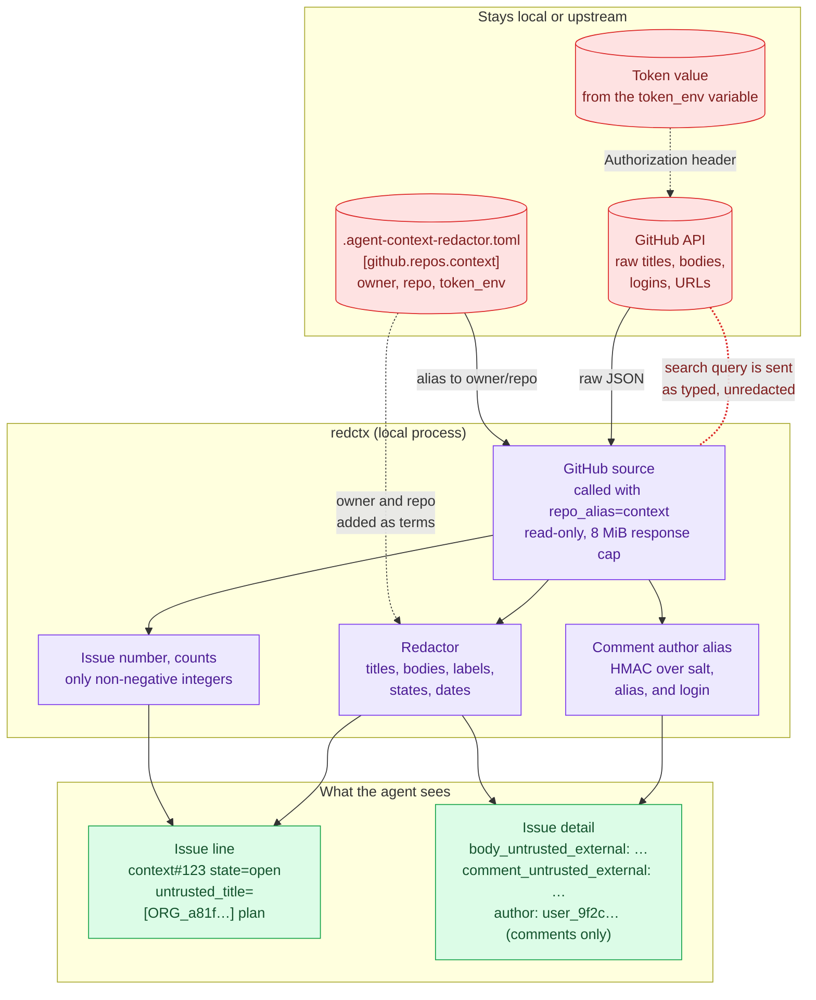

The MCP server exposes the same flow with:

- `redctx_github_repos`
- `redctx_github_list_issues`
- `redctx_github_read_issue`
- `redctx_github_search_issues`

Outputs redact titles, bodies, labels, and comments, and mark GitHub text as
untrusted external content. Raw author logins and raw GitHub URLs are not
printed; comment authors are shown as stable per-vault, per-repo opaque ids,
and the issue author is not printed.

## Discover Terms With A Local LLM

`redctx discover` can draft `.agent-context-redactor.toml` using a local
Ollama model. This is a human setup command, not an MCP tool, because its output
intentionally contains the raw names you want to redact.

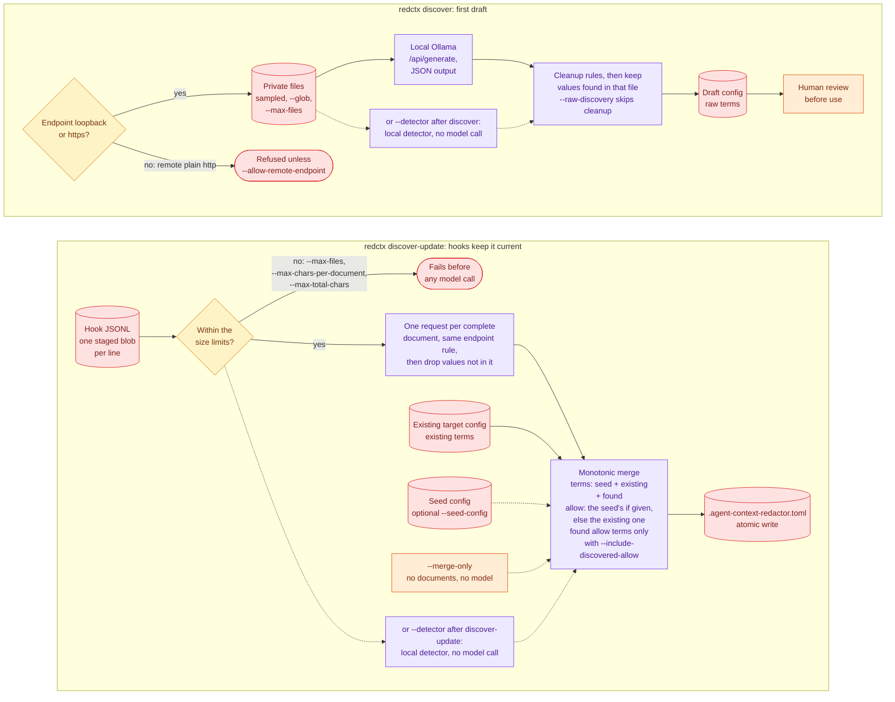

Example with a small local model:

```sh
ollama pull gemma4:e4b
redctx --root ../source-private discover context progress archive \
  --model gemma4:e4b \
  --glob "*.md" \
  --output .agent-context-redactor.toml
```

If you switch models, use the exact tag from `ollama list`.

Review the generated file before use. To avoid overwriting an existing config,
the command refuses to write over `--output` unless `--force` is passed.

Discovery output is post-processed with generic cleanup rules. The cleanup
does not include project-specific names; it only:

- omits public/default-allowed terms that the redactor already allows;
- moves other likely tool/package names to `allow`;
- drops obvious filenames, meeting/ticket IDs, country-only values, job titles,
  and generic workflow/process labels;
- strips role notes from full names such as `Alice Example (CIO)`;
- ignores single first names by default because they over-redact.

Use `--raw-discovery` if you want the local model's categories with only basic
dedupe. Either way, model values that do not occur in the sampled file are
dropped; the match is case-insensitive and keeps the file's casing.

Useful options:

```sh
redctx --root ../source-private discover --help
redctx --root ../source-private discover context --format json
redctx --root ../source-private discover context --raw-discovery
redctx --root ../source-private discover context --max-files 20 --max-chars-per-file 8000
redctx --root ../source-private discover context --endpoint http://localhost:11434
```

The command uses Ollama's local `/api/generate` endpoint with streaming disabled
and JSON output requested. No hosted LLM is called by this feature. Non-loopback
plain-http endpoints are refused unless you pass `--allow-remote-endpoint`,
because discovery payloads contain raw private text.

### Automate Incremental Config Updates

Repository hooks can classify exact staged Git blobs without duplicating the
MCP's discovery and merge policy. Supply one JSON object per line:

```json
{"path":"private/meeting.md","text":"raw staged document text","sha256":"optional-source-digest"}
```

Then call the hook-facing CLI:

```sh
redctx --root ../source-private discover-update \
  --input-jsonl /tmp/staged-documents.jsonl \
  --seed-config config/redaction-seed.toml \
  --output-config .agent-context-redactor.toml \
  --model gemma4:e4b
```

`discover-update` sends each complete document to the configured local Ollama
endpoint in a separate request. It drops model values that do not occur in
that document (a case-insensitive substring match that keeps the document's
casing), monotonically adds sensitive terms, keeps reviewed
seed policy settings authoritative, preserves unrelated TOML tables and
comments, and writes atomically. By default, model output cannot expand the
allow-list.

Documents are never silently truncated. A document over
`--max-chars-per-document`, or an input set over `--max-total-chars`, fails
before the model is called. Set those limits to fit the selected model's actual
context window. `--merge-only` applies a reviewed seed change without reading
documents or calling Ollama.

The equivalent Python composition API is:

```python
from redacted_context_mcp import (
    DiscoveryDocument,
    build_discovery_update,
    discover_documents,
    write_discovery_update,
)
from redacted_context_mcp.discovery import OllamaDiscoveryClient

documents = [DiscoveryDocument(path="private/meeting.md", text=raw_text)]
client = OllamaDiscoveryClient(
    endpoint="http://127.0.0.1:11434",
    model="gemma4:e4b",
    timeout=120,
)
discovery = discover_documents(documents, client=client)
update = build_discovery_update(existing_toml, discovery, seed_text=seed_toml)
write_discovery_update(config_path, update)
```

Both interfaces intentionally handle raw private text and raw discovered names.
Keep them local and outside an agent's accessible workspace. This feature
reduces what a separate coding model receives; it is not encryption, DLP, or a
proof that the local model found every sensitive entity.

## Claude Code Permissions

MCP routing is the main workflow. Claude Code permissions can add guardrails by
denying direct reads/searches into the private source folder and allowing only
the redacted MCP tools. See
[examples/claude-settings.example.json](examples/claude-settings.example.json).

## Security Model

This project is a practical privacy guardrail, not a formal de-identification
system.

It helps because:

- the agent starts in a neutral folder with no raw context files;
- the useful operations are exposed as redacted MCP tools;
- filenames can be navigated through opaque ids;
- raw names, emails, URLs, phones, and configured terms are redacted.

The `rehydrate` command intentionally reverses redacted exports for the local
operator. `redctx_submit_doc` can also rehydrate generated redacted text, but
only when MCP writes are explicitly enabled and only into the configured write
subdirectory. Submitted content is verified to redact consistently on
read-back, and the write subdirectory itself is never used as a rehydration
source. Do not run rehydration workflows from an agent workspace where the
model can read raw output.

Additional guardrails:

- The redaction config (default or explicit `--config`), configured term
  files, `.env*`, `*.key`, `*.pem`, and `*.crt` files are never served through
  redacted tools, even with `--include-private`, with case-folded matching so
  `.ENV` and `server.PEM` variants are refused too.
- Bare long hex strings (the vault-salt shape), salt-keyed assignments, and
  underscore-qualified secrets such as `DB_PASSWORD=...` are redacted by
  default.
- MCP searches enforce an operation deadline, and user-supplied regexes are
  matched in an isolated, killable child process after a fast-fail screen for
  catastrophic-backtracking patterns, so a crafted regex cannot hang the
  server.
- `redctx discover` refuses non-loopback plain-http Ollama endpoints unless
  `--allow-remote-endpoint` acknowledges the exposure.
- Placeholders are deterministic HMACs over the vault salt. Keep the salt in
  the local config or user-local state; `REDACTED_CONTEXT_SALT` can be visible
  in process environments, and anyone holding the salt can verify dictionary
  guesses against placeholders.

It is not a hard security boundary if the agent process runs as the same OS
user that can read the private source folder. For hard enforcement, run the
agent as a separate OS user or container without filesystem access to the
private source folder, and expose only the MCP server or a separate redaction
service.

## Development

See `ARCHITECTURE.md` for the design boundaries and `CONTRIBUTING.md` for local
development and release checks.

```sh
PYTHONPATH=src python3 -m unittest discover -s tests -p 'test_*.py'
python3 -m py_compile src/redacted_context_mcp/core.py src/redacted_context_mcp/server.py
```

## License

MIT.
